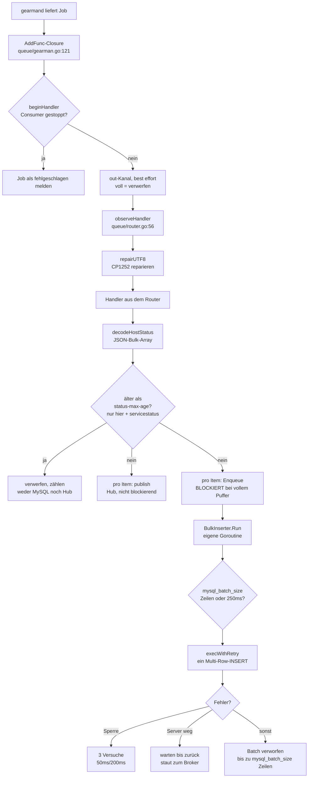

# Audit-Route durch den Worker

Eine Lesereihenfolge für das Code-Review vor dem Prod-Einsatz. Nicht als
Referenz gedacht, sondern als Route: von vorne nach hinten lesbar, und jeder
Durchgang setzt voraus, dass der vorherige gelesen wurde.

Der Umfang ist überschaubarer, als er wirkt. Von 16.139 Zeilen Go sind 8.729
Produktivcode und 7.410 Tests. Davon sind wiederum drei Dateien
(`registry.go`, `main.go`, `rabbitmq.go`) fast ein Drittel — der Rest ist klein
und einzeln lesbar.

**Zu Zeilennummern:** dieses Dokument nennt vorrangig Funktionsnamen, weil die
stabil bleiben. Wo Zeilennummern stehen, sind sie ein Sprungziel für den Stand
vom 15.08.2026, kein Versprechen.

---

## Die fünf Durchgänge

| # | Durchgang | Dateien | Frage, die er beantwortet |
|---|---|---|---|
| 1 | Das Skelett | `cmd/app/main.go` | Was wird in welcher Reihenfolge gestartet? |
| 2 | Der Weg eines Events | `queue/router.go`, `queue/registry.go`, `db/db.go` | Was passiert mit einer Nachricht? |
| 3 | Die Nebenläufigkeit | `queue/gearman.go`, `websocket/hub.go`, `db/db.go` | Wer läuft parallel, wer wartet auf wen? |
| 3b | Das Fehlerverhalten von MySQL | `db/db.go` (`execWithRetry`) | Wann wird wiederholt, wann geht etwas verloren? |
| 4 | Die Sonderfälle | `queue/downtime_processor.go`, `queue/processor.go`, `registry.go` | Wo weicht der Code vom Muster ab? |

Halten Sie beim Lesen `CLAUDE.md` daneben. Die Architekturregeln 1–6 dort sind
keine nachträgliche Beschreibung, sondern die Vorgabe, gegen die der Code
geschrieben wurde — der Code verweist an vielen Stellen namentlich darauf.

---

## Durchgang 1 — Das Skelett

**Nur eine Datei: `cmd/app/main.go`, und darin nur `main()` ab Zeile 530.**
Alles darüber ist Konfigurationsauflösung (Flag > Env > YAML > Default); die
können Sie im ersten Durchgang überspringen und später gezielt nachlesen.

`main()` ist bewusst als nummerierte Sequenz geschrieben. Die Startreihenfolge:

1. **Konfiguration und Logger** — `loadConfig()`, `setupLogger()`
2. **`pipelineCtx`** wird angelegt. Wichtig für das Verständnis des ganzen
   Prozesses: dieser Context ist **nicht** der primäre Abschaltmechanismus,
   sondern ein Sicherheitsnetz. Er wird erst gecancelt, *nachdem* Consumer und
   Puffer schon sauber heruntergefahren sind.
3. **WebSocket-Hub** in eigener Goroutine (`hub.Run(pipelineCtx)`)
4. **`/ws`-HTTP-Server** auf `cfg.listenAddr`, Default `127.0.0.1:8080`
5. **`/metrics`-HTTP-Server** auf eigenem Port, Default `:9105` — bewusst ein
   getrennter Listener, damit ein Scrape nie die Request-Queue des
   WebSocket-Servers teilt
6. **MySQL**: `sql.Open`, `configureDBPool`, `PingContext` (5s),
   `logConnectionCharset`
7. **Graphite-Client** wird gebaut — aber noch nicht verbunden
8. **`queue.NewRouter(...)`** liefert `Router` (12 Queues) und `[]Runner`
   (15 Stück). Jeder Runner bekommt seine eigene Goroutine. Direkt davor wird
   `-status-max-age` geparst und die effektive Einstellung einmalig geloggt —
   die einzige Konfiguration, die absichtlich Daten verwirft.
9. **Consumer** (`gearman` oder `rabbitmq`) wird gebaut und gestartet

Danach blockiert `main()` auf `<-sigCtx.Done()`.

**Worauf Sie hier achten sollten:** die drei Dinge, die *nicht* über `wg`
laufen. Die beiden HTTP-Server und der Drain-Loop für `rawMessages` (Zeile 651)
werden mit blankem `go func()` gestartet und nicht in die WaitGroup
aufgenommen. Bei den HTTP-Servern ist das korrekt — sie werden am Ende über
`Shutdown()` beendet. Ob der Drain-Loop sauber terminiert, hängt daran, dass
`consumer.Stop()` den Kanal schließt; das ist der Punkt, den Durchgang 3
aufgreift.

---

## Durchgang 2 — Der Weg eines Events

Nehmen Sie eine Nachricht auf `statusngin_hoststatus` und verfolgen Sie sie.

Die Kette in Dateien:

| Schritt | Ort |
|---|---|
| Job-Annahme | `queue/gearman.go`, `Start()` → `w.AddFunc(...)` |
| Zähler, UTF-8-Reparatur, Dauermessung | `queue/router.go`, `observeHandler` |
| Zuordnung Queue → Handler | `queue/registry.go`, `NewRouter` (Zeile 715) |
| Decode | `queue/decode.go`, `decodeHostStatus` |
| Broadcast | `queue/router.go`, `publish` |
| Altersfilter (nur Status-Queues) | `queue/router.go`, `NewStaleDroppingHandler` |
| Persistenz | `db/db.go`, `Enqueue` → `Run` → `flushBuffer` → `execWithRetry` |

**Die drei Stellen, an denen ich beim Review genau hinsehen würde:**

`NewHandler` in `router.go:106` ist das Muster. Nur drei Queues nutzen sie
direkt (`hostchecks`, `servicechecks`, `logentries`) und zwei weitere die
gefilterte Variante darunter, aber alle übrigen Handler sind Varianten
derselben vier Zeilen: decode → publish → Enqueue. Wenn Sie die verstanden
haben, verstehen Sie den Großteil des Routers.

`publish` in `router.go:233` prüft `hub.HasClients()` und überspringt das
JSON-Marshalling komplett, wenn niemand verbunden ist. Das ist der heißeste
Pfad im Worker. Die Konsequenz ist bewusst in Kauf genommen: die Antwort ist
eine Momentaufnahme, ein sich gerade verbindender Client verpasst das Event.

`Enqueue` in `db/db.go:185` ist die Stelle, an der der Datenpfad **wartet statt
zu verwerfen.** Wenn `b.in` (Kapazität = `mysql_batch_size`, Standard 100) voll
ist, blockiert der Handler.
Genau das ist beabsichtigt: der Rückstau wandert über den Handler und den
Concurrency-Cap des Consumers bis zum Broker, wo er einen Worker-Neustart
überlebt. Regel 2 in `CLAUDE.md` beschreibt das im Detail.

Der zweite Wartepunkt liegt eine Stufe dahinter und ist neu: `execWithRetry`
blockiert, solange MySQL nicht erreichbar ist — wodurch `Run` blockiert,
wodurch `Enqueue` blockiert. Derselbe Rückstaupfad, ausgelöst von der anderen
Seite. Durchgang 3b geht darauf ein.

**`NewStaleDroppingHandler` in `router.go:162` ist die einzige Stelle im
Worker, die Events absichtlich wegwirft.** Sie ersetzt `NewHandler` für genau
`statusngin_hoststatus` und `statusngin_servicestatus`: Events, deren
Envelope-Timestamp älter als `-status-max-age` (Default 5m) ist, erreichen
weder MySQL noch den Hub. Die Begründung — beides sind Snapshots, die einander
überschreiben, und ein Rückstau davon ist nach einem Ausfall wertlos — steht
im Funktionskommentar. Beim Audit ist hier zweierlei zu prüfen: dass wirklich
nur diese beiden Queues so verdrahtet sind (jede andere Queue trägt Historie,
dort wäre es schlicht Datenverlust), und dass Ihnen die Konsequenz bei
Uhren-Drift bewusst ist.

---

## Durchgang 3 — Die Nebenläufigkeit

Der Teil mit dem höchsten Risiko und deshalb der, für den Sie sich am meisten
Zeit nehmen sollten.

### Wer läuft

Bei laufendem Betrieb mit Gearman-Backend und einem verbundenen Dashboard:

| Goroutine | Anzahl | Start | Ende |
|---|---|---|---|
| `hub.Run` | 1 | `main.go:572` | `pipelineCtx` gecancelt |
| `BulkInserter.Run` | 14 | `main.go:624` | `pipelineCtx` oder `b.in` geschlossen |
| `graphite.Client.Run` | 1 | ebenda (als 15. Runner) | dito |
| `/ws`- und `/metrics`-Server | 2 | `main.go:583`, `:595` | `Shutdown()` |
| `rawMessages`-Drain | 1 | `main.go:651` | Kanal geschlossen |
| `w.Work()` (Bibliothek) | 1 | `gearman.go:165` | `w.Close()` |
| Job-Handler | 0…64 | von der Bibliothek | pro Job |
| `logStatsPeriodically` | 1 | `gearman.go:166` | `statsDone` oder ctx |
| ctx-Wächter | 1 | `gearman.go:168` | ruft `Stop()` |
| `readPump`/`writePump` | 2 pro Client | `client.go:133` | Verbindungsende |

Die Job-Handler sind der einzige unbegrenzt wachsende Posten — und genau
deshalb gedeckelt. `-gearman-max-concurrent-jobs` (Default 64) ist kein
Durchsatzregler, sondern der Schutz gegen unbegrenzten Speicherverbrauch beim
Neustart nach einem Ausfall. Die Begründung steht ausführlich über
`NewGearmanConsumer` in `gearman.go:67`.

### Die Kanäle

| Kanal | Kapazität | Bei „voll" |
|---|---|---|
| `BulkInserter.in` | `mysql_batch_size` (100) | **blockiert** — der einzige Rückstaupunkt |
| `BulkInserter.flushReq` / `pauseReq` | 0 | Rendezvous mit `Run` |
| `Hub.broadcast` | 1024 | verwirft, zählt `publish_dropped_total` |
| `Hub.register` / `unregister` | 0 | Rendezvous mit `Run` |
| `Client.send` | 256 | verwirft für diesen Client |
| Consumer-`out` | 256 | verwirft (nur Observability) |

Die Asymmetrie ist die Kernaussage von Regel 4: **auf dem Weg zur Datenbank
wird gewartet, auf dem Weg zum WebSocket wird verworfen.** Ein langsamer
Browser darf die Ingestion nie ausbremsen.

### Wer auf wen wartet

Drei Wartepunkte, alle beim Herunterfahren:

- `GearmanConsumer.Stop()` wartet auf `handlerWG` — alle laufenden Job-Handler.
  Davor wird `stopped = true` unter Schreibsperre gesetzt, damit die WaitGroup
  nicht mehr wachsen kann. Die Begründung dieses Musters steht im Feldkommentar
  bei `stoppedMu` (`gearman.go:56`) und ist einer der Punkte, die ich beim
  Audit zweimal lesen würde.
- `flushRunners` wartet auf alle 15 Runner — **nebenläufig**, mit 10s
  Gesamtbudget. Der Kommentar bei `main.go:445` erklärt, warum sequenziell
  falsch war.
- `wg.Wait()` in `main()` wartet auf Hub und alle Runner-Loops.

`WithPaused` in `db/db.go:223` ist ein vierter, seltener Fall: der
Core-Restart-Handler hält den BulkInserter an, um selbst ein Statement gegen
dieselbe Tabelle abzusetzen. Wenn Sie eine Deadlock-Quelle suchen, ist das die
interessanteste Stelle im Repo.

---

## Durchgang 3b — Das MySQL-Fehlerverhalten

Kurz, aber der Teil mit der direktesten Datenverlust-Relevanz. Eine Datei,
eine Funktion: `execWithRetry` in `db/db.go:467`, aufgerufen ausschließlich
aus `flushBuffer`.

Zwei Dinge müssen Sie vorher verinnerlicht haben, weil alles Weitere daran
hängt:

- **Der Job ist quittiert, sobald `Enqueue` zurückkehrt** — nicht, wenn die
  Zeile in MySQL steht. Ein MySQL-Fehler erreicht Gearman nie, ein
  fehlgeschlagener Schreibvorgang wird also nie erneut geliefert.
- **Batches werden bei `mysql_batch_size` Zeilen geschnitten, unabhängig von Job-Grenzen.**
  Ein Batch enthält routinemäßig Events aus mehreren Jobs — deshalb reißt eine
  einzige schlechte Zeile fremde Events mit.

Die Klassifikation:

| Klasse | Erkennung | Versuche | Backoff |
|---|---|---|---|
| Sperren | `1213` Deadlock, `1205` Lock wait timeout | 3 | 50ms, 200ms |
| Server weg | `driver.ErrBadConn`, `mysql.ErrInvalidConn`, jeder `net.Error`, `1053`, `1040`, `1927` | bis er zurück ist | 100ms → 5s gedeckelt |
| Alles andere | Truncation, `NOT NULL`, unbekannte Spalte | 1 — Batch wird verworfen | — |

**Der zweite Fall ist der, den ich beim Audit genau lesen würde.** Solange
MySQL weg ist, blockiert der Flush — und damit `Run`, `Enqueue`, der Handler
und am Ende der Concurrency-Cap. Der Rückstau landet beim Broker. Das ist
Absicht und gemessen: Verwerfen kostete bei fünf Sekunden Ausfall **29.400 von
150.000 Events**, Warten kostete bei sechzehn Sekunden Ausfall nichts.
Die Konsequenz, die man mittragen muss: ein dauerhaft kaputtes MySQL legt die
Pipeline still, statt die Queue ins Leere zu leeren.

Warum ein Retry überhaupt gefahrlos ist, steht in `newRedeliverySafeInserter`
(siehe Shutdown-Abschnitt): zehn Tabellen schreiben als No-Op-Upsert. Die
verbleibende Lücke ist ein Verbindungsabbruch *mitten* im Statement — dann ist
unbekannt, ob MySQL es ausgeführt hat, und der zweite Versuch kann in
`logentries` und `perfdata` eine Zeile doppelt anlegen. Dieselben zwei
Tabellen, dieselbe Begründung wie bei der Neulieferung.

Es gibt in Go übrigens **keinen Fehler 2006 („MySQL server has gone away")** —
das ist eine Client-Nummer aus libmysqlclient. Wer danach sucht, sucht
vergeblich; der Treiber meldet `invalid connection` oder einen Dial-Fehler.

---

## Durchgang 4 — Die Sonderfälle

Fünf Queues folgen dem Muster aus Durchgang 2 unverändert bzw. mit
Altersfilter. Die übrigen sieben weichen ab, in vier Gruppen:

**Perfdata** (`queue/processor.go`) — `NewPerfdataHandler` routet jede Metrik
nach `perfdataRoute` in MySQL, nach Graphite oder in beides (Regel 5). Der
Graphite-Client wird immer gestartet; wenn die Route ihn ausschließt, wird
schlicht nie `Enqueue` aufgerufen und keine Verbindung aufgebaut.

**Downtimes** (`queue/downtime_processor.go` + `db/downtime.go`) — der einzige
Bereich, der die BulkInserter-Abstraktion komplett umgeht. Eine Nachricht kann
je nach Typ INSERT, UPDATE oder DELETE über zwei Tabellenpaare auslösen.
`DetermineDowntimeActions` ist reine Logik ohne Datenbank und dadurch gut
testbar. **Lesen Sie vorher `.claude/specs/downtime_ablauf.txt`** — die
Zustandsmatrix dort ist die Spezifikation, der Code ist nur ihre Umsetzung.

**Core-Restart** (`registry.go:359`) — leert bei `object_type` 102 die
Status-Tabellen. Nutzt `WithPaused`, siehe oben. Das Verhalten hängt an
`enableOpenITCockpitTweaks`.

**Notifications** (`registry.go:228` und `:280`) — filtert nach NEB-Typ (605
bzw. 601) und teilt einen Eingangsstrom auf zwei Tabellen (Host/Service) auf.
Hier lohnt ein Blick darauf, ob die Filterkonstanten zu Ihrer Naemon-Version
passen.

---

## Der Shutdown

Der heikelste Teil und in `main.go:661` bewusst durchnummeriert. Die
Reihenfolge trägt die ganze Zusage aus Regel 6:

1. `consumer.Stop()` — **zuerst**, damit nichts Neues mehr hereinkommt
2. `flushRunners(flushCtx, runners)` — 10s, alle 15 nebenläufig
3. `cancelPipeline()` — beendet die (nun leeren) Run-Loops und den Hub
4. `wg.Wait()`
5. `sqlDB.Close()`
6. `httpServer.Shutdown()`, `metricsServer.Shutdown()` — 5s

Die Absicherung gegen Datenverlust liegt tiefer, in `BulkInserter.Run`: sowohl
bei `ctx.Done()` als auch beim geschlossenen Eingangskanal wird erst
`drainPending()` und dann `finalFlush()` gerufen. `finalFlush` baut sich einen
eigenen 5s-Context, weil der reguläre zu diesem Zeitpunkt schon abgelaufen ist.
Ohne diesen Umweg wäre der letzte Batch still verloren.

**Dieser Teil ist gemessen, nicht nur gelesen** — mit `cmd/losstest`:

> Bei 300.000 Events, SIGTERM mitten im Abarbeiten, Neustart und vollständigem
> Leerlaufen gingen ursprünglich **3.300 Events (1,1 %) endgültig verloren.**
> Der Flush-Pfad war nie die Ursache — zwei ununterbrochene Kontrollläufe
> verloren nichts. Schuld war die Kombination aus Wiedereinreihung durch
> gearmand (exakt 64 Jobs, der Concurrency-Cap), Batches, die unabhängig von
> Job-Grenzen bei der Batch-Größe geschnitten werden (damals fest 100), und
> einem `Error 1062`, der
> den **gesamten** Multi-Row-INSERT mitsamt der frischen Zeilen darin
> abbricht. **Behoben:** derselbe Ablauf liefert jetzt 300.000 von 300.000
> und keinen einzigen 1062.

Das wurde an **zwei** Stellen behoben, und beim Audit sollten Sie verstanden
haben, warum keine die andere ersetzt:

1. **`newRedeliverySafeInserter` in `registry.go`** — zehn Tabellen schreiben
   als Upsert, dessen Update-Klausel die erste Spalte des Primärschlüssels
   nennt und damit ein echtes No-Op ist. Das macht eine Neulieferung
   *folgenlos*.
2. **gearman-go v1.1.1** — `Close()` ließ die laufenden Handler ihre Quittung
   nicht mehr absetzen, weshalb gearmand die Jobs wieder einreihte. Jetzt wird
   erst geleert, dann getrennt. Das lässt die Neulieferung bei einem geordneten
   Shutdown *gar nicht erst entstehen*.

Punkt 2 deckt nur den geordneten Fall ab. Bei Absturz, OOM-Kill oder verlorener
Quittung im Netz liefert der Broker weiterhin erneut aus — **exactly-once ist
hier nicht erreichbar.** Punkt 1 ist deshalb der tragende Teil; wer ihn mit dem
Argument „Neulieferung passiert ja nicht mehr" entfernt, holt sich den
1,1-%-Verlust beim ersten harten Kill zurück.

`logentries` und `perfdata` sind bewusst ausgenommen — Details unter Regel 6 in
`CLAUDE.md`.

Ein Fall bleibt: **Shutdown, während MySQL nicht erreichbar ist.** Der
Retry-Loop aus Durchgang 3b respektiert den Context, der Flush bekommt also
sein 10s-Budget und gibt danach auf — was nicht geschrieben werden konnte, ist
weg. Das ist die richtige Abwägung (ein Shutdown darf nicht hängen), aber es
heißt: einen Worker während eines Datenbankausfalls neu zu starten kostet
seine Puffer.

---

## Prüfpunkte

Konkrete Invarianten, die halten müssen — die Punkte, an denen ein Fehler
teuer wäre:

- [ ] **Kein Datenverlust bei SIGTERM unter Last.** Erfüllt und mit
      `cmd/losstest` nachgemessen (300.000/300.000). Vor jedem Release
      wiederholen — es ist der einzige Test, der diese Zusage wirklich prüft.
- [ ] **`logentries` und `perfdata` dürfen Duplikate haben.** Bei einem
      Neustart unter Last können bis zu 6.400 Zeilen doppelt entstehen, ohne
      Fehlermeldung. Bewusst akzeptiert — prüfen Sie, ob das für Ihre
      Perfdata-Graphen tragbar ist.
- [ ] **Kein Datenverlust bei einem MySQL-Neustart.** Erfüllt und gemessen
      (150.000/150.000 über 16s Ausfall, null verworfene Batches). Der Worker
      wartet und staut zum Broker zurück, statt die Queue ins Leere zu leeren.
      Die Kehrseite bewusst mittragen: ein dauerhaft kaputtes MySQL legt die
      Pipeline still.
- [ ] **Alarm auf `statusengine_db_available`.** `0` heißt: Pipeline steht auf
      MySQL. Das ist die aussagekräftigste einzelne Metrik im ganzen Worker.
- [ ] **`statusengine_pipeline_errors_total{component="mysql"}` ist flach.**
      Jede Erhöhung ist ein verworfener Batch, also bis zu `mysql_batch_size`
      verlorene Zeilen — in der Praxis ein Schemafehler und ein Vorfall, kein
      Rauschen. Wer die Batch-Größe anhebt, hebt diesen Radius mit an.
- [ ] **`mysql_batch_size` liegt im erlaubten Bereich und ist bewusst gewählt.**
      Der Worker verweigert den Start außerhalb von 1..700, die Grenze ist also
      nicht umgehbar — aber sie ist auch nicht willkürlich: bindend sind nicht
      *n* Zeilen, sondern die `2n-1` eines Drain-Flushes beim Shutdown, und bei
      43 Spalten reißt das ab 750 die 65535-Platzhalter-Grenze eines Prepared
      Statements (`Error 1390`, deterministisch, also **nicht** wiederholt).
      Prüfen Sie, ob eine Anhebung überhaupt etwas bringt: bei 250 ms Ticker
      greift eine Batch-Größe *N* erst oberhalb von rund 4·*N* Events/s **auf
      dieser einen Tabelle**.
- [ ] **`status_max_age` und die Uhren.** Der Vergleich läuft zwischen der Uhr
      des Monitoring-Cores und der des Workers. Driften die beiden Hosts um
      mehr als den eingestellten Wert auseinander, werden `hoststatus` und
      `servicestatus` **vollständig und lautlos** verworfen. Prüfen Sie, dass
      beide Hosts NTP haben, und legen Sie ein Panel auf
      `statusengine_queue_events_discarded_stale_total` — auch (gerade) wenn
      es null anzeigen soll.
- [ ] **`-mysql-max-open-conns` ≥ Anzahl Runner**, sonst serialisiert der Pool
      den Shutdown-Flush innerhalb des 10s-Budgets. Default 25 gegen 15 Runner
      passt; bei mehr Queues mitwachsen lassen.
- [ ] **`-gearman-max-concurrent-jobs` ist nie 0.** `gearman.Unlimited` *ist*
      0, ein versehentliches Nullen stellt genau das unbegrenzte Verhalten
      wieder her, das der Cap verhindern soll.
- [ ] **API-Keys sind gesetzt.** Ohne Konfiguration erzeugt `resolveAPIKeys`
      einen Zufallsschlüssel pro Start und loggt ihn als Warnung — der Stream
      ist nie offen, aber nach jedem Neustart anders.
- [ ] **`-listen-addr` bleibt auf Loopback**, außer Sie exponieren bewusst.
- [ ] **Kein `charset=` in der MySQL-DSN.** Der Treiber handelt utf8mb4 im
      Handshake aus; `logConnectionCharset` warnt beim Start, wenn nicht.
- [ ] **Die `age_*`-Werte in der `config.yml` sind bewusst gesetzt.** `0`
      schaltet eine Tabelle ab — geerbte Semantik des PHP-Workers.
- [ ] **Alarm auf `statusengine_websocket_publish_dropped_total`**, nicht auf
      `messages_dropped_total`. Der erste bedeutet, dass der Hub insgesamt
      nicht mehr mitkommt; der zweite ist bei einem langsamen Browser-Tab
      normal.
- [ ] **`statusengine_queue_jobs_in_flight` dauerhaft am Cap** heißt: der
      Rückstau liegt beim Broker. Ein zweiter Worker-Prozess macht das
      schlimmer, nicht besser — der Engpass liegt hinter der Annahme.

---

## Was nicht im Worker-Prozess läuft

Damit Sie es beim Audit nicht doppelt lesen: `cmd/db_cleanup` (Retention,
für Cron/systemd-Timer), `cmd/db_verifier` (read-only Vergleich gegen die
PHP-Datenbank), `cmd/simulator`, `cmd/gearman_publisher` und
`cmd/rabbitmq_publisher` (Testwerkzeuge) sind eigenständige Binaries. Keines
davon läuft im Worker mit. `db_cleanup` teilt sich lediglich die YAML-Datei —
möglich, weil beide mit einfachem `yaml.Unmarshal` dekodieren und unbekannte
Schlüssel in beide Richtungen ignorieren.

Für den Prod-Einsatz ist von diesen nur `db_cleanup` relevant, und dort vor
allem eine Frage: läuft es in einem Cluster auf **genau einem** Knoten? Der
PHP-Worker warnt ausdrücklich davor, das parallel laufen zu lassen.

---

## Grenzen dieser Route

Damit klar ist, was dieses Dokument *nicht* leistet: es ist eine
Lesereihenfolge, kein Audit-Ergebnis. Ich habe den Aufrufgraph verifiziert und
die Nebenläufigkeitsstellen benannt, aber keine Sicherheitsanalyse der
Auth-Pfade gemacht, keine SQL-Injektionsprüfung über alle Query-Builder
gezogen und die Downtime-Zustandsmatrix nicht gegen die Spezifikation
durchgerechnet.

Neu hinzugekommen und entsprechend frisch: der Altersfilter für die beiden
Status-Queues und das Retry-Verhalten in `execWithRetry`. Beides ist
Ende-zu-Ende gemessen (500/500 verworfen bzw. 150.000/150.000 über einen
16-Sekunden-MySQL-Ausfall), aber es ist der jüngste Code im Repo und verdient
beim Audit entsprechend mehr Aufmerksamkeit als die Teile, die seit Wochen
laufen.

Insbesondere die Query-Konstruktion in `db/downtime.go` baut Tabellen- und
Spaltennamen per String-Konkatenation zusammen. Das ist hier vertretbar, weil
diese Namen ausschließlich aus Konstanten stammen und Werte durchgehend über
Platzhalter gehen — aber es ist eine Stelle, an der ein späterer Umbau leise
gefährlich werden kann, und damit ein guter Kandidat für Ihren eigenen zweiten
Blick.
